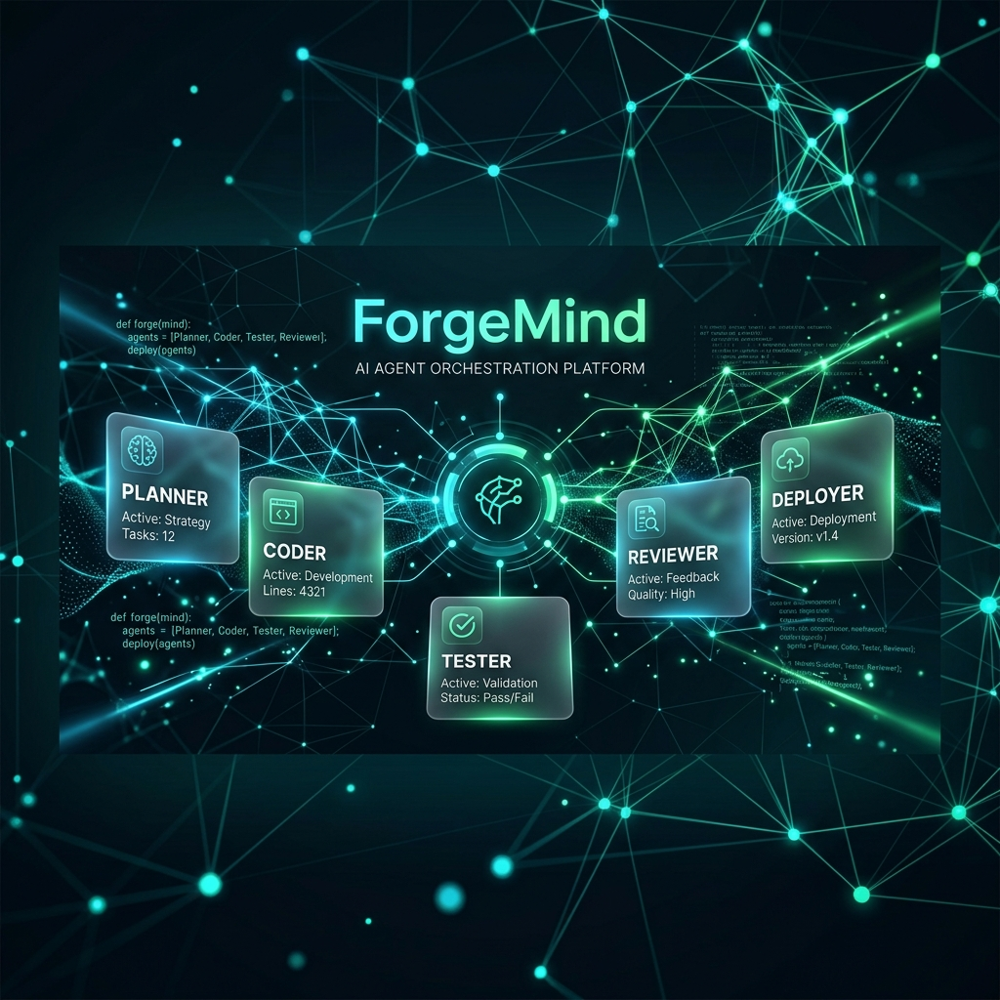
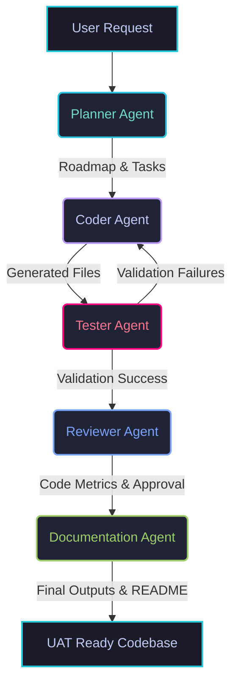

# ForgeMind - Multi-Agent Development Team

<p align="center">
  
</p>

<p align="center">
  
  
  
  
</p>

---

ForgeMind is a full-stack, state-of-the-art agentic software development suite. It orchestrates a collaborative graph-based team of specialized AI agents (Planner, Coder, Tester, Reviewer, and Documentation) to autonomously plan, code, verify, and document software features inside isolated local workspaces.

---

## 🔄 Live Orchestration Pipeline



---

## 🏗️ Architecture Overview

The system is split into three main components:

1. **Frontend (Next.js)**: A sleek dashboard offering live WebSocket tracking of the agent graph progress, console output logs, and code/test diff visualizations.
2. **Backend (FastAPI)**: Runs the LangGraph agent state machine, handles local workspace sandbox execution, and connects to LLM providers.
3. **Agent Orchestration Graph (LangGraph)**:
   - **Planner Agent**: Analyzes requests, decomposes goals into specific milestones.
   - **Coder Agent**: Implements the required file changes inside the local workspace path.
   - **Tester Agent**: Executes pytest suites or syntax compiler verification, feeding test failures back to the coder for automatic self-healing.
   - **Reviewer Agent**: Evaluates implementation and test coverage metrics against coding standards.
   - **Documentation Agent**: Automatically writes high-quality READMEs and UAT documentation for the completed feature.

---

## 🚀 Getting Started

### 📋 Prerequisites
- **Python 3.10+**
- **Node.js 18+**
- **Docker & Docker Compose** (optional, for DB services)

### 🛠️ Backend Setup
1. Navigate to the backend directory:
   ```bash
   cd backend
   ```
2. Create and activate a Python virtual environment:
   ```bash
   python3 -m venv venv
   source venv/bin/activate
   ```
3. Install the dependencies:
   ```bash
   pip install -r requirements.txt
   ```
4. Create a `.env` file in the `backend/` directory:
   ```env
   DATABASE_URL=sqlite:///./forgemind.db
   GEMINI_API_KEY=your_gemini_api_key
   GROQ_API_KEY=your_groq_api_key
   ```
5. Run the FastAPI server:
   ```bash
   uvicorn app.main:app --host 0.0.0.0 --port 8000 --reload
   ```

### 💻 Frontend Setup
1. Navigate to the frontend directory:
   ```bash
   cd frontend
   ```
2. Install npm dependencies:
   ```bash
   npm install
   ```
3. Launch the Next.js development server:
   ```bash
   npm run dev
   ```
4. Open [http://localhost:3000](http://localhost:3000) in your web browser.

---

## ⚙️ Key Resiliency Features
- **Daily Quota & Rate-Limit Resiliency**: Automatic priority switching between **Gemini 2.5 Flash** and **Groq (Llama 3.1)** API keys.
- **Offline Fallback Simulation**: Employs robust offline fallback structures if remote APIs are unavailable or daily quotas are completely exhausted.
- **State-Machine Code Parser**: Cleanly extracts source files from LLM code fences, filtering out planning annotations and preventing compiler syntax errors.
